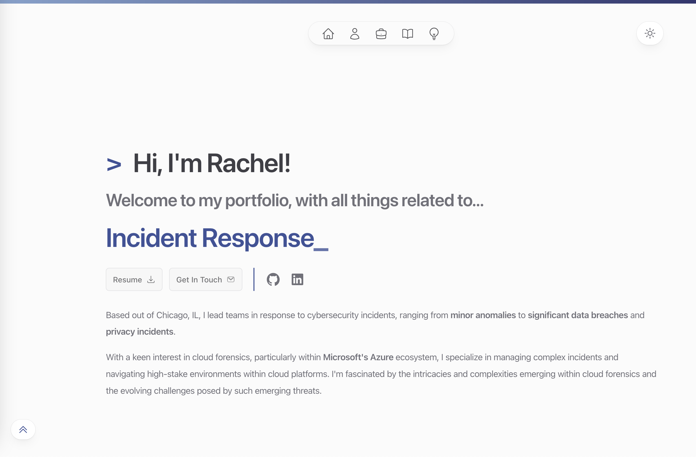

# Rachel's Portfolio

  

 

 Welcome to my <a href="https://www.rachelk.xyz">portfolio</a>! 

This site is a side project I started in April 2024 to showcase my experiences working in the Digital Forensics and Incident Response (DFIR) industry, learn more about front end web development, and to build something from scratch that I can call my own.

## 💻 Technologies Used

The website <a href="https://rachelkang.xyz/" target="_blank">rachelkang.xyz</a> was built using and/or including the following technologies: 

<ul>
    <li> Framework by <a href="https://nextjs.org/" target="_blank" rel="noreferrer noopener">Next.js 14</a> - A React framework for server-side rendering and generating static websites</li>
    <li> Written in <a href="https://www.typescriptlang.org/" target="_blank" rel="noreferrer noopener">TypeScript</a> - A typed superset of JavaScript that compiles to plain JavaScript</li>
    <li> Styling with <a href="https://tailwindcss.com/" target="_blank" rel="noreferrer noopener">Tailwind CSS</a> - A utility-first CSS framework for rapidly building custom user interfaces</li>
    <li> Styling with <a href="https://headlessui.com/" target="_blank" rel="noreferrer noopener">Headless UI</a> - Unstyled, accessible UI components designed to integrate seamlessly with Tailwind CSS</li>
    <li> Styling with <a href="https://mdxjs.com/" target="_blank" rel="noreferrer noopener">MDX Components</a> - Markdown for the component era, allowing you to write JSX in your Markdown documents</li>
    <li> Icons by <a href="https://heroicons.com/" target="_blank" rel="noreferrer noopener">Heroicons</a> - SVG icons designed for smooth integration with Tailwind CSS</li>
    <li> Built on <a href="https://code.visualstudio.com/" target="_blank" rel="noreferrer noopener">Visual Studio Code</a> - Versatile code editor from Microsoft with support for JavaScript, TypeScript, and a wide array of other languages and tools</li>
    <li> Deployed with <a href="https://vercel.com/" target="_blank" rel="noreferrer noopener">Vercel</a> - Cloud platform for deploying, scaling, and monitoring websites and applications, optimized for Next.js frameworks.</li>
</ul>

## 🎨 Color Reference

| Color         | Hex                                                                |
| ------------- | ------------------------------------------------------------------ |
| Light BG      |  `#EEEEEE` |
| Dark BG       |  `#1C1B21` |
| Lightest Blue |  `#AFC8DF` |
| Light Blue    |  `#83A3CE` |
| Default Blue  |  `#3D5399` |
| Dark Blue     |  `#292B66` |

## 📫 Contact

If you have any questions, feel free to reach out at kpxrachel@gmail.com.

<ul>
  <li> <a href="https://www.linkedin.com/in/rkang821/" target="_blank" rel="noreferrer noopener"> LinkedIn </a> 
  <li> <a href="https://github.com/rkang821" target="_blank" rel="noreferrer noopener"> GitHub </a> 
</ul>

## 📄 License

This project is licensed under the MIT License - see the LICENSE file for details.
