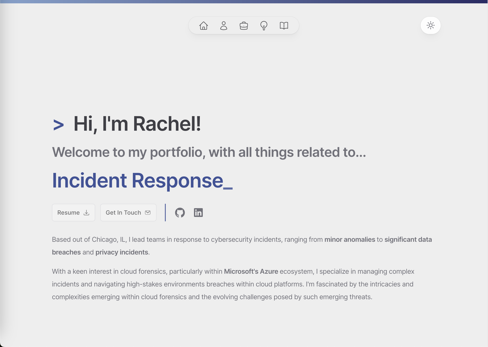

# Rachel's Portfolio

<h2 align="center">
Welcome to my personal portfolio! </h2>
 

  

 

This site is a side project I started in April 2024 to showcase my experiences working in the Digital Forensics and Incident Response (DFIR) industry, learn more about front end web development, and just to build something from scratch that I can call my own.

## 🔨 Built With

The website <a href="https://rachelkang.xyz/" target="_blank">rachelkang.xyz</a> was built using and/or including the following technologies: 

<ul>
    <li> Framework by <a href="https://nextjs.org/" target="_blank" rel="noreferrer noopener">Next.js 14 </a> - Enhances React apps with automatic routing, API routes, and built-in optimizations for both static and server-rendered applications</li>
    <li> Written in <a href="https://www.typescriptlang.org/" target="_blank" rel="noreferrer noopener"> TypeScript </a> - Extends JavaScript by adding types, enabling earlier detection of bugs and richer editor support</li>
    <li> Styling with <a href="https://tailwindcss.com/" target="_blank" rel="noreferrer noopener"> Tailwind CSS </a> - Utility-first framework for crafting custom UIs directly in your markup</li>
    <li> Styling with <a href="https://headlessui.com/" target="_blank" rel="noreferrer noopener"> Headless UI </a> - Unstyled, accessible UI components designed to integrate seamlessly with Tailwind CSS</li>
    <li> Styling with <a href="https://mdxjs.com/" target="_blank" rel="noreferrer noopener"> MDX Components </a> - Allows you to write JSX in your Markdown documents, combining rich content with interactive or reusable components seamlessly</li>
    <li> Icons by <a href="https://heroicons.com/" target="_blank" rel="noreferrer noopener"> Heroicons </a> - SVG icons designed for smooth integration with Tailwind CSS</li>
    <li> Built on <a href="https://code.visualstudio.com/" target="_blank" rel="noreferrer noopener"> Visual Studio Code </a> - Versatile code editor from Microsoft with support for JavaScript, TypeScript, and a wide array of other languages and tools</li>
    <li> Deployed with <a href="https://vercel.com/" target="_blank" rel="noreferrer noopener"> Vercel </a> - Cloud platform for deploying, scaling, and monitoring websites and applicationsm, optimized for Next.js frameworks.</li>
</ul>

## 🎨 Color Reference

| Color         | Hex                                                                |
| ------------- | ------------------------------------------------------------------ |
| Light BG      |  `#EEEEEE` |
| Dark BG       |  `#1C1B21` |
| Lightest Blue |  `#AFC8DF` |
| Light Blue    |  `#83A3CE` |
| Default Blue  |  `#3D5399` |
| Dark Blue     |  `#292B66` |
